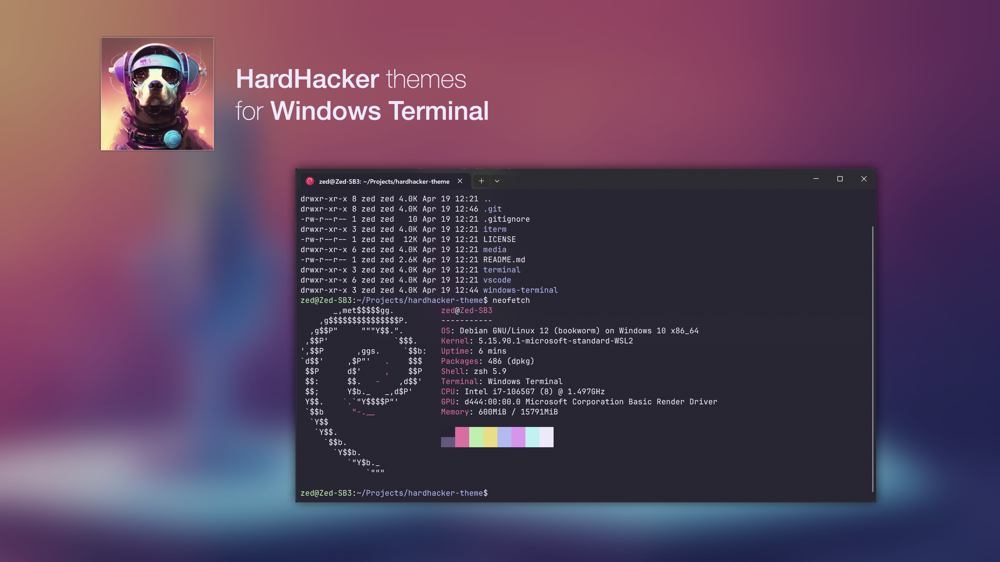

<p align="center">
  
</p>

<h1 align="center">
  HardHacker Theme for Windows Terminal
</h1>



## Install

Copy `theme.json`'s content , paste to Windows terminal's settings.json `schemes` array,
and then change `profiles.colorScheme` to `Hardhacker`。

```json
...
"profiles": {
    "colorScheme": "Hardhacker",
    ...
},
"schemes": [
        {
            "name": "Hardhacker",
            ...
        }
]
```
